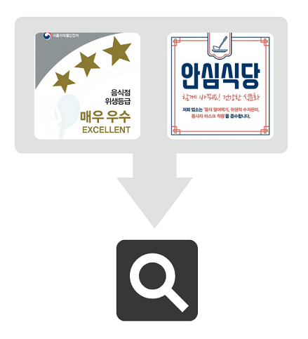
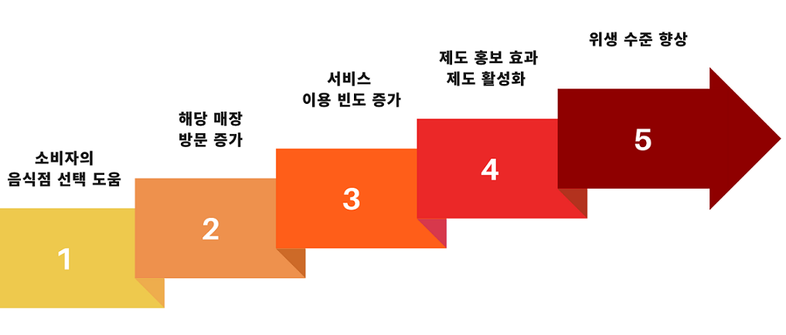
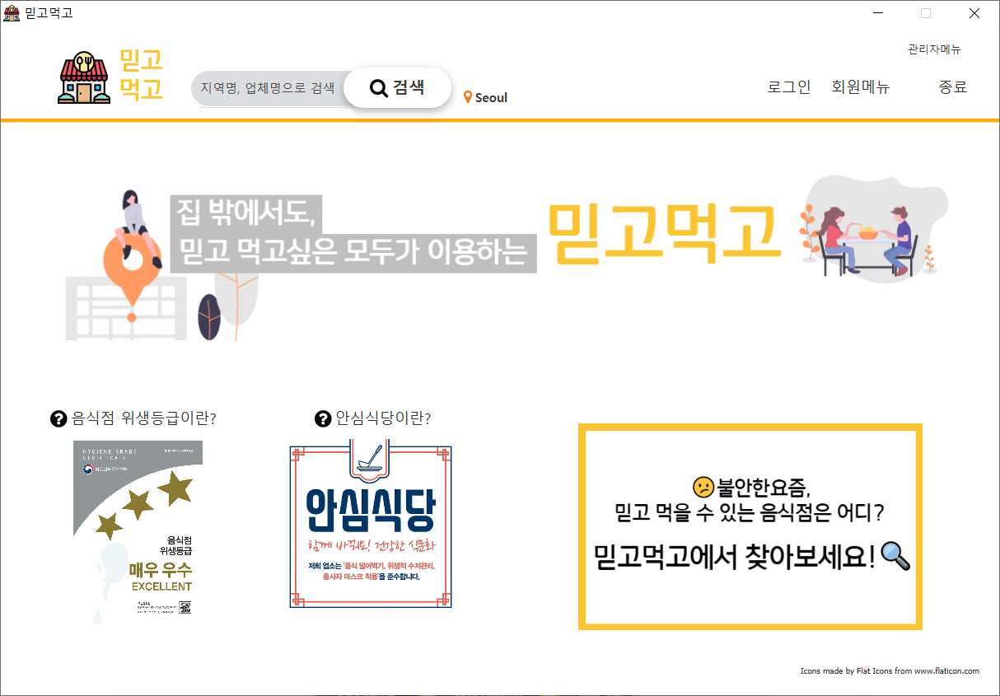
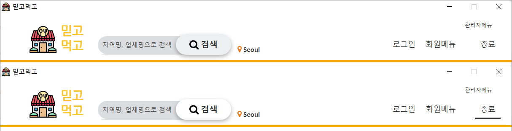
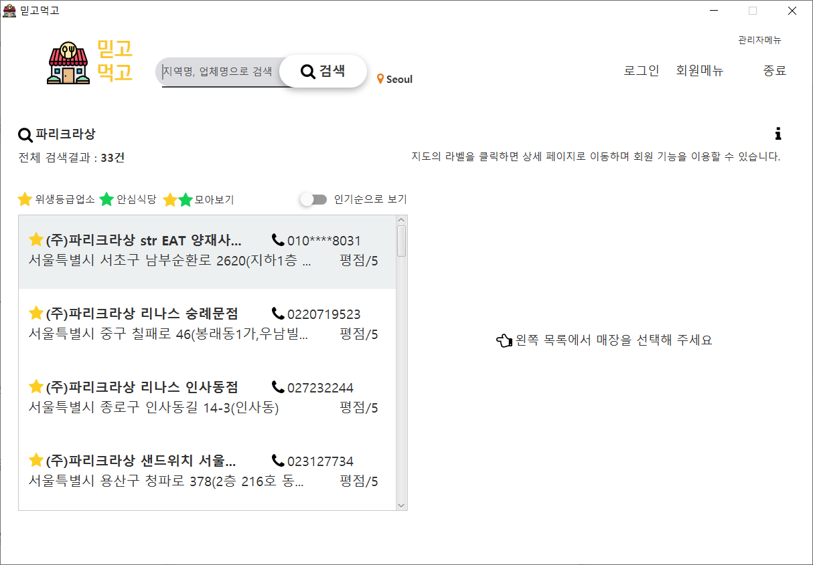
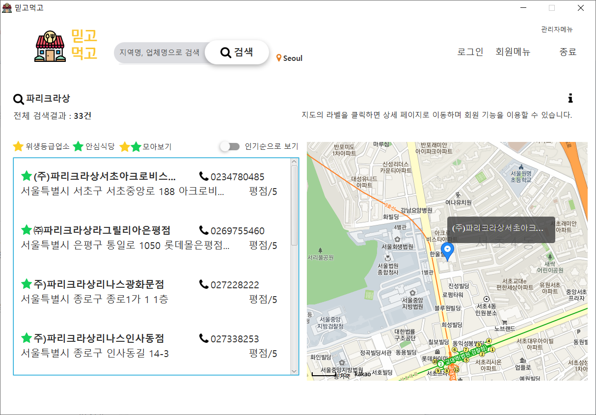
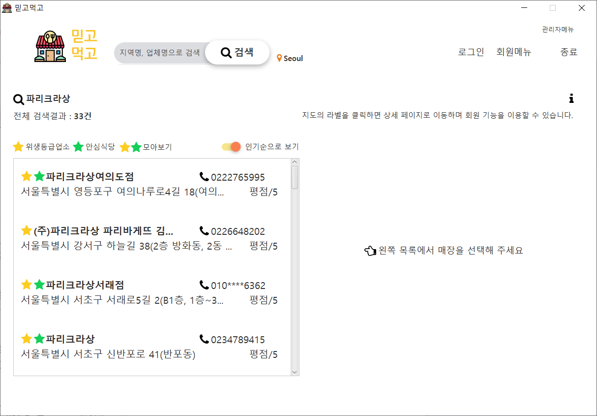
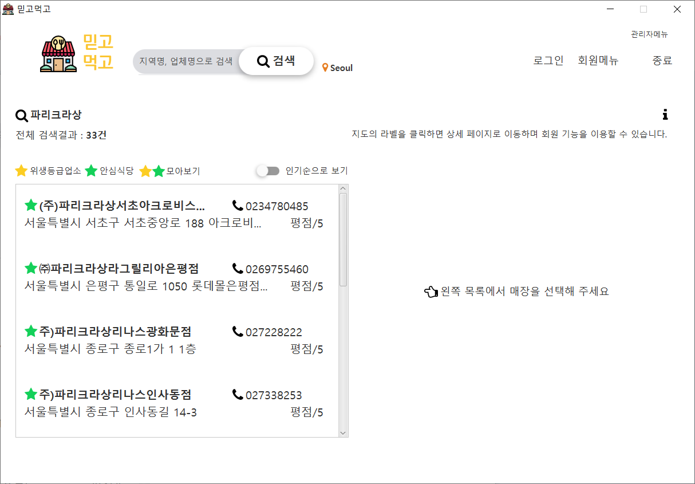

# 믿고 먹고 😋

### 믿고 먹을 수 있는 음식점을 찾아서 - mini project

Java FX, SQLite, APIs: [식품의약품 안전처\_식품접객업소 위생등급 지정현황](http://www.foodsafetykorea.go.kr/), [농림축산식품부\_안심식당 정보](https://data.mafra.go.kr/main.do), [kakao map](https://apis.map.kakao.com/), [IP Geolocation](https://ip-api.com/)

version1 - 2021.2. (2 weeks)

## 프로젝트 목적

지속되는 코로나 19 상황 속에서도 학교, 직장 등으로 인해 외식은 피할 수 없습니다. 하지만 취식을 위해 마스크를 벗어야 하는 현실과 그에 따른 위험 노출을 조금이나마 줄일 수 있는 것이 음식점의 **위생 관리**와 **코로나 감염 예방 노력**일 것입니다.

식품의약품 안전처의 위생등급제와 농림축산식품부의 안심식당 제도는 이러한 정보를 전달해줍니다.

-   위생등급제 : 음식점 위생상태를 평가하여 우수한 업소에 등급을 지정 (식품의약품 안전처)

-   안심식당 : 3대 식사문화개선수칙을 준수하는 음식을 안심식당으로 지정 (농림축산식품부)

### 🔍 둘 다 찾고싶은, '**위생등급**'과 '**안심식당**'

-   위생등급 및 안심식당 해당 음식점 정보는 식품안전나라, 혹은 포털사이트, 지도 애플리케이션 등을 통해 각각 따로 찾아볼 수 밖에 없었습니다.

-   믿고먹고는 이 두가지 정보를 모아서 찾을 수 있는 서비스를 제공합니다.

-   이를 통해 제도에 대한 접근성을 높여 더욱 많은 사람들이 제도를 활용하여 좀 더 위생적이고 믿을 수 있는 음식점에 방문할 수 있기를 희망합니다.

## 프로젝트 기대 효과

1. 소비자의 음식점 선택에 도움
2. 해당 매장 방문 증가 (홍보효과)
3. 믿고먹고 서비스 이용 빈도 증가
4. 제도 홍보 효과 및 제도 활성화
5. 위생 수준 향상

위생을 중요 기준으로 두는 소비자들의 선택권을 보장하고 이에 따른 음식점의 유입고객 증가와 매출 향상을 기대 할 수 있습니다.

서비스 이용이 늘어나면 제도에 대한 홍보 효과와 그에 따른 국민 전체적인 위생 수준 향상도 기대할 수 있습니다.

제도의 목적인 음식점 위생관리, 코로나 수칙 준수와 식중독 등 전염병의 예방과 코로나 방역효과를 기대할 수 있습니다.

## 실행 화면

실행 첫 화면

        src\main\view\MainView.java

음식점 위생등급 배너, 안심식당 배너 클릭시 [제도 안내 팝업](./images/popup-1.png) 생성

---

사용자의 현재위치 표시 (검색버튼 오른쪽)

홈버튼, 검색바, 회원메뉴

---

검색결과

음식점명 혹은 지역이름으로 검색 가능

기본 abc - 가나다순 정렬

---

음식점 위치 확인

선택한 음식점의 위치를 지도에서 확인

---

인기순 정렬

매장 정보 확인을 위한 클릭수를 기반으로 인기순 정렬

---

모아보기 기능

-   위생등급 매장, 안심식당 매장 모두 모아보기
-   위생등급만 보기
-   안심식당만 보기

모아보기 상태에서도 인기순 / 일반 정렬 가능

---

기타 기능

팝업으로 음식점 상세 정보 (위생등급 등)확인, 공유버튼 클릭하여 클립보드에 복사 등
